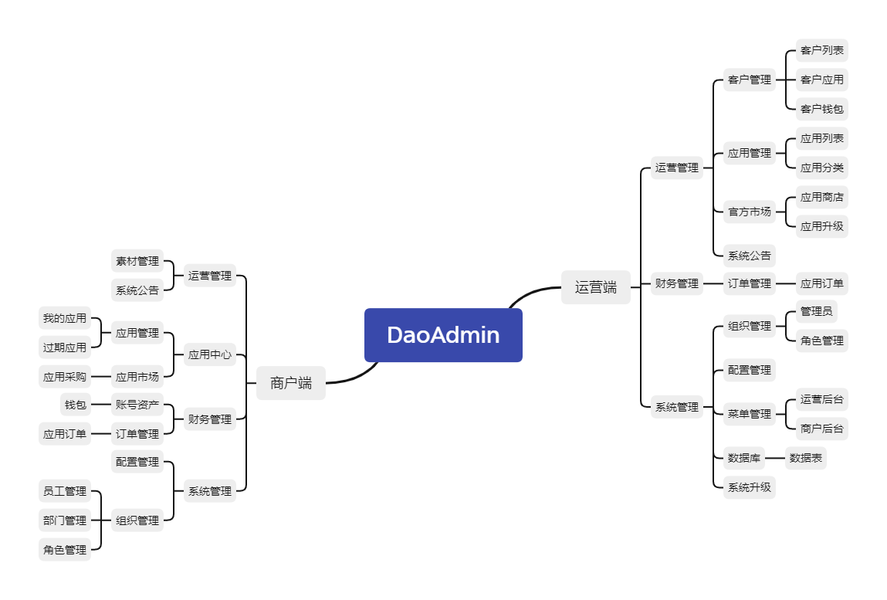

# DaoAdmin

DaoAdmin是一款基于webman的高性能中后台框架，一样的写法，十倍的性能。

#### 主要特性：
- 高稳定性: webman基于workerman开发，workerman一直是业界bug极少的高稳定性socket框架。
- 超高性能：webman性能高于传统php-fpm框架10-100倍左右，比go的gin echo等框架性能高一倍左右。
- 高复用：无需修改，可以复用绝大部分composer组件及类库。
- 高扩展性: 支持自定义进程，可以做workerman能做的任何事情。
- 简单易用：学习成本极低，代码书写与传统框架没有区别。
- 多商户：每个商户数据隔离，每个商户还可以构建自己的组织架构，角色权限控制清晰。
- SaaS引擎：支持多应用,每个应用遵循相同范式，拥有独立后台管理。
- 免费升级：产品生命周期内永久免费升级和技术指导服务。
- 文档齐全：提供完善的开发文档,数据库字典和入门应用案例。
- RBAC权限：细颗粒度的微权限控制,可控制权限到流程。
- 开放：100%开源代码高度开源,为开发者赋能。

#### 功能地图：  

#### 体验账号
- 运营后台：http://daoadmin.oudewa.cn/admin  (账号：daoadmin  密码：123456)
- 商户后台；http://daoadmin.oudewa.cn/tenant  (账号：daoadmin  密码：123456)

#### 软件架构
- [webman](https://www.workerman.net/doc/webman)
- Mysql
- Redis
- [Layui](https://www.layui.com/) 
- [Layuimini](http://layuimini.99php.cn/)

#### 安装及使用文档
- 要求PHP >= 7.4
- 创建项目：
~~~shell script
composer create-project fudaoji/dao-admin  daoadmin
~~~
- 开通端口

开启8790端口

- 运行服务

进入daoadmin目录
~~~shell script
php start.php start -d
~~~

- 安装数据

浏览器访问 http://ip地址:8790，进入安装步骤，按界面要求操作即可。

- 进入后台

管理后台: http://ip地址:8787/admin  

#### 参与贡献

1.  Fork 本仓库
2.  新建 dev 分支
3.  提交代码
4.  新建 Pull Request

#### 交流
如果对您有帮助，麻烦star走一波，感谢！

QQ交流群：
726177820

微信交流群：

#### 版权信息
[DaoAdmin] 遵循Apache2开源协议发布，并提供免费使用。

使用本框架不得用于开发违反国家有关政策的相关软件和应用，否则自行承担一切法律责任！